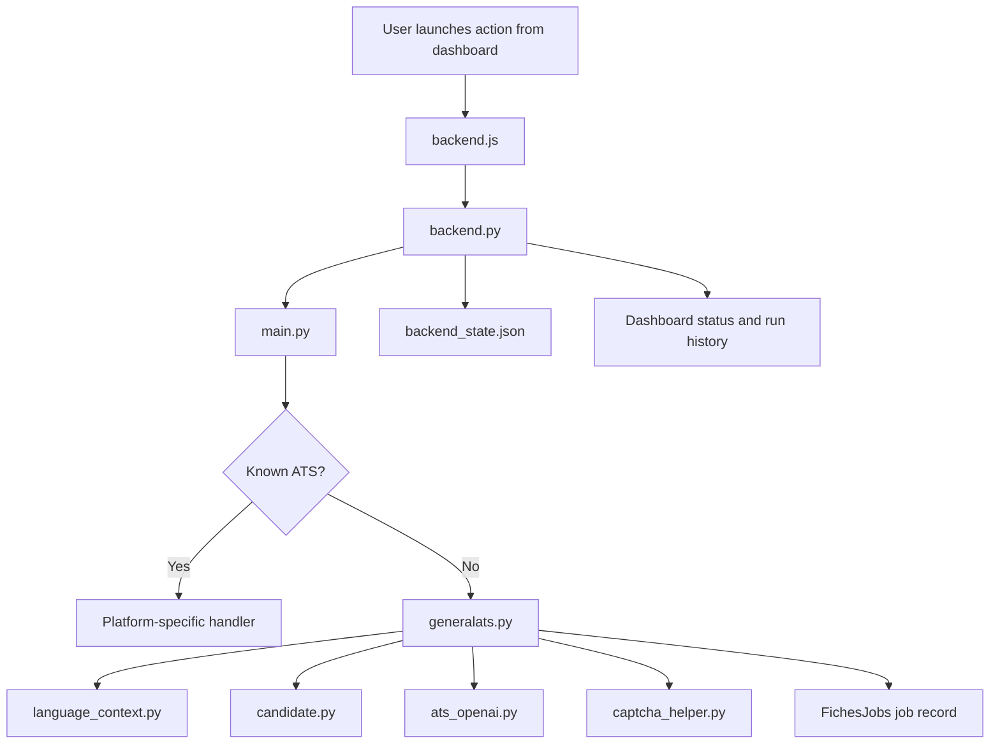

# PROJET.HR White Paper

## 1. Introduction

PROJET.HR is an AI-assisted recruitment automation system designed to reduce the manual effort involved in job discovery, application handling, and ATS form submission. The project combines browser automation, platform detection, language-aware interaction, candidate profile management, and targeted LLM-based inference to operate across a range of job application environments.

At a high level, the system aims to answer a practical question:

How can a single automation framework navigate heterogeneous ATS platforms, understand their forms, and complete job applications with as little manual intervention as possible while still remaining configurable and observable?

This white paper documents the current architecture of the system, its major modules, the end-to-end application process, and the mechanisms used for field inference, account handling, captcha solving, proxy routing, and state persistence.

## 2. Core Objectives

The project is built around six core objectives:

- Automate repetitive job application tasks across multiple ATS platforms.
- Normalize interactions with structurally different application forms.
- Reuse candidate data intelligently across many applications.
- Detect and handle multilingual environments.
- Combine deterministic automation with targeted LLM inference for ambiguous fields.
- Provide centralized monitoring, orchestration, and run history through a backend interface.

## 3. System Overview

The system is organized into several cooperating layers:

- `backend.py`: orchestration, run management, state persistence, scheduling, and API endpoints.
- `backend.js`: browser-side dashboard logic for launching and monitoring runs.
- `main.py`: application entry point and ATS dispatch layer.
- `generalats.py`: generic ATS automation engine used when no platform-specific handler is available.
- `candidate.py`: candidate profile store and account memory per ATS/company.
- `language_context.py`: language detection and normalization.
- `ats_openai.py`: structured OpenAI calls for intent and answer inference.
- `captcha_helper.py`: reCAPTCHA and DataDome detection, solving, and proxy integration.
- `retrieval_sources.py` and scanner modules: source configuration and job retrieval.
- `FichesJobs/*.json` and `backend_state.json`: job-level and run-level persistence.

## 4. Architecture Diagram

## 5. Main Execution Flow

The automation workflow begins when a user launches an application either for a single job, a direct URL, or a bulk selection of jobs from the backend interface. The backend constructs a run object, records initial metadata, and invokes `main.py` as the execution entry point for each target application URL.

`main.py` performs two essential tasks:

- detect the likely ATS based on the URL
- dispatch execution to the appropriate automation module

Known ATS platforms such as Greenhouse, SmartRecruiters, Workday, SuccessFactors, and Jobup are routed to specialized handlers. If the URL does not match one of those known platforms, the request falls back to `generalats.py`, which acts as the generic application engine.

This creates a hybrid design:

- specialized flows for ATS platforms with known structure
- a generic adaptive engine for everything else

## 6. End-to-End Application Lifecycle

The complete lifecycle of a single application can be described as follows.

## 7. ATS Detection and Dispatch

The ATS detection logic lives in `main.py`. Its first role is classification by URL pattern. If the URL contains a known domain marker, the corresponding platform module is selected. Otherwise the URL is treated as unknown and passed to the generic ATS engine.

This routing strategy is important because the system does not assume that one automation style fits all platforms. Some ATS providers have stable and recognizable flows that benefit from dedicated code paths, while others are more effectively handled through generic detection and interaction logic.

The dispatch layer therefore acts as the boundary between:

- explicit platform support
- generalized application automation

## 8. Backend Orchestration and Run Management

`backend.py` is the operational control layer of the system. It maintains global application state, stores recent runs, schedules listing jobs, and exposes the information needed by the dashboard.

Three persistent collections are especially important:

- `application_runs`: single, URL-based, and bulk application runs
- `listing_runs`: job retrieval runs
- `scheduler`: recurring listing configuration and last-run metadata

These values are persisted in `backend_state.json`. The backend normalizes stale runs on startup, ensuring that previously interrupted automation is marked appropriately instead of being left in an ambiguous running state.

Bulk application mode is also controlled here. For each job in a run, the backend launches the main automation process, then refreshes the related job record to determine:

- final status
- whether the application is marked done
- any discovered user questions
- the ATS program inferred for reporting

This design allows the dashboard to present both run-level and item-level outcomes.

## 9. Job-Level Persistence

The detailed state of an application is not stored only in the run history. Each job also has its own JSON record under `FichesJobs/`.

Those job files typically contain:

- the original job metadata
- one or more ATS-related blocks
- application completion flags
- application status text
- discovered required questions, dropdowns, checkboxes, and other structured form requirements

This separation is deliberate:

- `backend_state.json` stores operational run history
- `FichesJobs/*.json` stores detailed per-job application state

The result is a two-level persistence model that supports both dashboard monitoring and detailed post-run inspection.

## 10. Generic ATS Engine

`generalats.py` is one of the central components of the project. It exists to handle application flows that are not fully covered by platform-specific modules.

Its responsibilities include:

- launching and controlling the browser session
- detecting the language context of the application
- navigating to the relevant apply flow
- identifying text fields, dropdowns, checkboxes, radio groups, segmented controls, and file upload areas
- inferring the semantic purpose of each field
- selecting and injecting values
- solving or recovering from common automation blockers
- detecting submission completion
- writing structured results back to persistent storage

The generic engine is designed as a layered decision system rather than a purely rule-based script. It applies local heuristics first, then escalates to runtime answers or LLM inference when deterministic signals are insufficient.

## 11. Language Detection

Application forms appear across multiple languages, and field meaning often changes depending on locale-specific labels. `language_context.py` is responsible for normalizing the application language before deeper field interpretation begins.

The detection sequence is layered:

1. Inspect the URL for explicit language markers such as `lang`, `locale`, `language`, or path fragments like `/fr`, `/de`, and `en_US`.
2. If the URL does not provide a reliable answer, fetch the page HTML and inspect language metadata such as `<html lang>` or locale meta tags.
3. If metadata is absent or inconclusive, estimate the language from token matches in the page content.
4. If the static HTML is insufficient, render the page through Playwright and inspect the final DOM.

The output is normalized into the supported internal language set, primarily English, French, and German. This language value then influences field keywords, button detection, and intent inference.

## 12. Apply-Path Discovery

Before a form can be filled, the system must reach the correct interactive entry point. This is more complex than simply clicking the first visible button because many career pages contain:

- marketing buttons
- account creation prompts
- cookie banners
- external redirects
- multiple competing call-to-action elements

`scanners/browser_flow_utils.py` provides standardized UI vocabulary for this stage. The project uses curated positive labels such as:

- apply
- apply now
- continue
- continue without account
- continue as guest
- postuler
- bewerben

It also uses negative labels to avoid misleading controls such as:

- login
- register
- create account
- social links
- cookie-only actions unrelated to progression

This stage helps the engine reach the real application path while minimizing accidental clicks on irrelevant controls.

## 13. Account Detection and Account Memory

Many ATS flows are gated by authentication or registration prompts. The system therefore needs to know whether a candidate likely already has an account for a given ATS and company.

That responsibility is handled by `candidate.py`.

The candidate layer:

- stores candidate identity and profile data
- derives a normalized company slug from the application URL
- maps ATS and company combinations to a boolean account existence flag
- exposes helpers such as `has_account_for_url(...)`
- can mark new accounts as known after successful creation or use

For example, SuccessFactors derives the company from a dedicated URL parameter, while other providers may derive it from the hostname. This allows the automation to distinguish between cases such as:

- account already exists, so sign-in is appropriate
- no known account exists, so registration may be needed
- guest or without-account flow is available, so no registration is necessary

This account memory reduces repeated friction across multiple applications to the same platform.

## 14. Form Field Detection and Intent Mapping

The most important technical challenge in job application automation is understanding what a field means before filling it.

`generalats.py` approaches this using semantic intent mapping. Instead of treating the form as a collection of arbitrary HTML elements, the engine tries to identify each element as a known business meaning such as:

- first name
- last name
- full name
- email
- phone
- address
- city
- postcode
- country
- region
- LinkedIn
- work permit
- salary expectation
- resume
- cover letter

The intent detection process combines several signal sources:

- visible label text
- placeholders
- nearby descriptive text
- aria labels and accessibility attributes
- grouped context for dropdowns or radio clusters
- upload-zone wording
- previously used intents in the same form

This logic is the bridge between low-level DOM parsing and high-level candidate data reuse.

## 15. Layered Answer Selection

Once a field’s intent is known or estimated, the system chooses how to answer it. The answer pipeline is layered by confidence and controllability.

### 15.1 Candidate Data

If a field maps cleanly to a known candidate attribute, the engine fills it directly from the candidate profile.

### 15.2 Runtime Answers

If a form contains a recurring but non-core question, runtime answers can be loaded and used to override or supplement default behavior. This is useful for repeated questions that are not naturally part of the static candidate profile.

### 15.3 Rule-Based Dropdown Matching

For dropdowns, radio groups, and segmented controls, the system attempts to match the best available option using local heuristics and normalized text.

### 15.4 OpenAI Inference

If local logic is not confident enough, the system can invoke OpenAI for one of two tasks:

- infer the most likely semantic intent of a field label
- infer the best answer or option given the field type, available choices, and candidate data

### 15.5 Fallback Recording

If the system remains uncertain, it records the unknown question for later review. This allows the project to improve over time without silently guessing on every low-confidence field.

## 16. OpenAI Integration

`ats_openai.py` is intentionally narrow in scope. It does not control the whole automation flow. Instead, it acts as a structured inference helper inside the broader deterministic system.

Two main functions are exposed:

- `infer_intent_with_openai(...)`
- `infer_answer_with_openai(...)`

Both functions call the OpenAI Responses API and request a JSON-schema-constrained output. This is an important design choice because it reduces ambiguity in downstream handling. Rather than receiving free-form language, the system receives structured fields such as:

- inferred intent
- confidence score
- selected answer or option
- reasoning string

This makes the LLM layer more auditable and easier to integrate into automation decisions.

Conceptually, the OpenAI layer is used only when:

- the field is ambiguous
- local keyword rules are insufficient
- dropdown options require semantic judgment
- the question is not already answered by candidate data or runtime configuration

In other words, AI is used as a targeted inference subsystem, not as the sole controller of the automation.

## 17. Uploads and Attachment Handling

Applications often require file uploads such as resumes, cover letters, or supplementary documents. The generic engine detects upload zones and attempts to infer the intended attachment type from surrounding context.

Common attachment intents include:

- resume / CV
- cover letter
- other document

The engine tracks whether a cover letter has already been used, distinguishes required from optional uploads where possible, and logs attachment-related uncertainty for later analysis.

## 18. Captcha and Anti-Bot Handling

Real-world application automation frequently encounters anti-bot challenges. `captcha_helper.py` addresses this problem through a combination of detection, solve orchestration, and controlled reinjection.

The module supports detection for:

- reCAPTCHA v2
- reCAPTCHA v3
- DataDome

For reCAPTCHA, the module inspects the page for relevant scripts, iframes, sitekeys, action names, and enterprise variants. For DataDome, it detects challenge URLs and determines whether the current context is solvable.

When solving is required, the system:

- reads the 2Captcha API key from environment variables
- constructs the required challenge payload
- optionally uses a proxy configuration for DataDome-sensitive flows
- polls for a solution token or cookie
- injects the solution back into the page session

The module also maintains cooldowns and challenge signatures to avoid redundant solve attempts. This matters operationally because some challenge types are expensive or temporarily unsolvable under the current network identity.

## 19. Proxy Handling

Some anti-bot scenarios, especially DataDome, require a matching or designated proxy context. The project therefore supports DataDome proxy configuration via environment variables.

That configuration can be used in two places:

- Playwright browser launch parameters
- the 2Captcha DataDome task payload

This alignment is important because certain challenge-solves are only valid when the token or cookie is associated with the same effective IP context used by the browser session.

## 20. Completion Detection

A successful automation run is not defined only by the act of clicking submit. The system must verify whether the application reached a meaningful completion state.

Completion detection relies on several signals:

- updated page content after submission
- application-specific status values
- per-job ATS blocks written back into storage
- final refresh of the job record after the subprocess finishes

`generalats.py` records fields such as:

- `application_status`
- `application_done`

The backend then re-reads the job record and summarizes the result into run-level reporting such as:

- success
- failed
- in progress
- paused
- completed with errors

This avoids relying exclusively on transient browser impressions and instead persists the interpreted outcome.

## 21. Bulk Application Mode

Bulk application mode extends the single-job model to a batch process managed by `backend.py`.

In this mode, the backend:

- assembles a list of eligible jobs
- creates a bulk run object
- processes each job sequentially
- updates item-level status as each subprocess returns
- exposes aggregate counters such as success, failure, skipped, and running

Runs can also be:

- paused
- resumed
- stopped
- cleared from the dashboard
- restarted in bulk mode

This turns the project from a one-off automation script into a controllable operational system.

## 22. Design Philosophy

Several recurring design principles shape the program:

### 22.1 Hybrid Specialization

Known ATS platforms receive dedicated logic, while unknown platforms are handled through a general adaptive engine.

### 22.2 Layered Decision-Making

The system prefers deterministic local rules first, then escalates to runtime overrides and finally to LLM inference.

### 22.3 Human-Readable Persistence

Job state and run state are stored in JSON files that remain inspectable outside the running program.

### 22.4 Operational Feedback

The backend and dashboard expose automation runs as explicit tracked entities rather than invisible background actions.

### 22.5 Pragmatic AI Usage

The model is used for structured ambiguity resolution, not for uncontrolled end-to-end browsing decisions.

## 23. Limitations

The current system has several practical limitations:

- ATS interfaces can change without warning.
- Generic inference may still misclassify unusual fields.
- Captcha and anti-bot systems are inherently unstable adversarial environments.
- Some workflows still require manual follow-up, especially for uncommon legal or compliance questions.
- The public presentation of the project may intentionally omit internal modules or sensitive operational details.
- Candidate and secret handling must be carefully separated before any public release.

These limitations are not failures of the architecture so much as consequences of operating in a highly variable external web environment.

## 24. Future Directions

Several improvements would strengthen the platform further:

- richer audit logs for field-by-field decisions
- more provider-specific adapters for common ATS families
- improved confidence reporting and uncertainty visualization
- stronger account lifecycle support for registration and sign-in branching
- better separation of public showcase code and private operational code
- additional localization support beyond English, French, and German
- expanded learning loops from previously unknown questions

## 25. Conclusion

PROJET.HR is best understood as an adaptive automation framework for job applications rather than a simple script. Its value comes from the interaction of several layers:

- backend orchestration
- ATS dispatch
- generic field understanding
- candidate-aware answer selection
- language normalization
- captcha and proxy handling
- structured LLM support
- persistent operational reporting

Together, these components form a system capable of navigating complex recruitment environments while remaining inspectable, configurable, and extensible.
